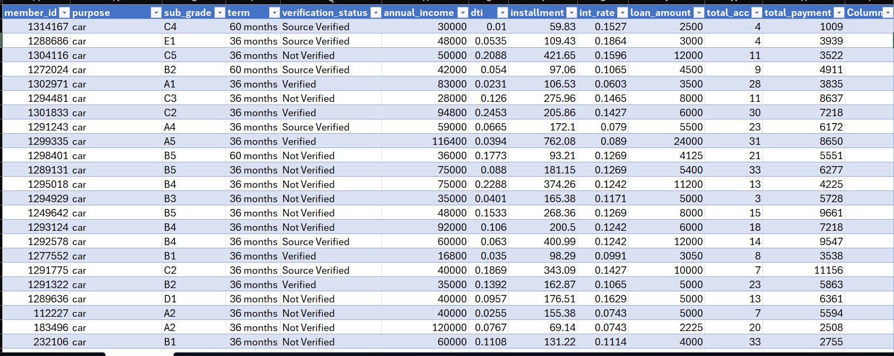
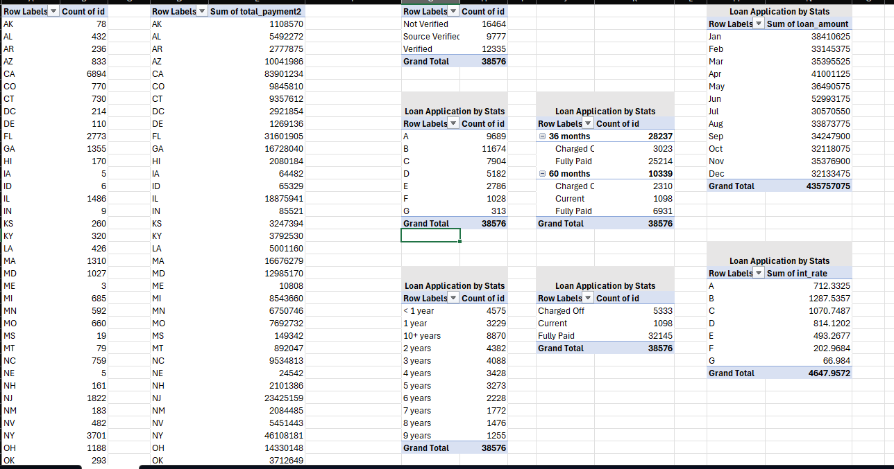
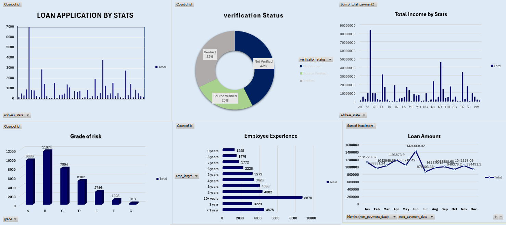

# Loan Applications Analysis Dashboard

A comprehensive Excel-based data analytics project that analyzes loan application data to uncover customer behavior, lending trends, loan performance, and financial insights. The project combines Microsoft Excel, Pivot Tables, Pivot Charts, and Interactive Dashboards to transform raw loan data into meaningful business intelligence.

---

# Overview

Financial institutions process thousands of loan applications every year. Understanding customer profiles, loan performance, verification status, repayment behavior, and risk distribution is essential for making better lending decisions.

This project demonstrates a complete Excel analytics workflow, including:

- Data Cleaning
- Data Transformation
- Pivot Table Analysis
- Interactive Dashboard Development
- Business KPI Analysis
- Trend Analysis
- Risk Analysis

The dashboard enables users to monitor loan performance and identify important business patterns through interactive visualizations.

---

# Business Problem

Banks and financial institutions face several challenges while managing loan applications:

- Identifying high-risk borrowers
- Monitoring loan repayment performance
- Understanding customer income patterns
- Tracking monthly loan applications
- Measuring verification status impact
- Analyzing loan distribution across states
- Evaluating customer credit grades

Without proper analytical dashboards, these insights are difficult to obtain quickly.

This project solves these challenges by creating an interactive reporting solution using Microsoft Excel.

---

# Objectives

The primary objectives of this project are:

- Analyze loan application trends
- Understand customer loan behavior
- Evaluate loan status distribution
- Monitor monthly loan performance
- Analyze verification status
- Identify risk grades
- Generate business insights for decision making

---

# Dataset Information

The dataset contains detailed loan application records.

### Key Features

- Member ID
- Loan Purpose
- Loan Grade
- Sub Grade
- Loan Amount
- Annual Income
- Interest Rate
- Installment
- Loan Term
- Verification Status
- Loan Status
- Employment Length
- Debt-to-Income Ratio (DTI)
- Total Accounts
- Total Payment
- Address State
- Issue Date
- Next Payment Date

The dataset consists of thousands of loan records used for business analysis.

---

# Tools and Technologies

- Microsoft Excel
- Pivot Tables
- Pivot Charts
- Interactive Dashboard
- Slicers
- Data Cleaning
- Conditional Formatting

---

# Project Workflow

## Step 1 — Data Collection

- Imported raw loan application dataset
- Verified data consistency
- Checked missing values

---

## Step 2 — Data Cleaning

Performed:

- Duplicate removal
- Data validation
- Date formatting
- Numeric formatting
- Column standardization

---

## Step 3 — Data Analysis

Created multiple Pivot Tables for analyzing:

- Loan Applications by State
- Loan Amount by Month
- Verification Status
- Loan Grades
- Loan Status
- Employment Experience
- Revenue Analysis
- Interest Rate Analysis

---

## Step 4 — Dashboard Development

Designed an interactive Excel dashboard using:

- Pivot Charts
- Doughnut Charts
- Column Charts
- Line Charts
- Bar Charts
- Timeline Filters
- Slicers

---

# Dashboard KPIs

The dashboard provides insights into:

- Total Loan Applications
- Total Loan Amount
- Total Payments Received
- Monthly Revenue
- Loan Distribution
- Customer Verification Status
- Employment Distribution
- Risk Grades
- Loan Status Analysis

---

# Analysis Performed

## Loan Applications by State

Analyzes the geographical distribution of loan applications to identify regions with the highest lending activity.

---

## Verification Status Analysis

Compares:

- Verified Customers
- Source Verified Customers
- Not Verified Customers

This helps evaluate customer verification patterns.

---

## Loan Grade Analysis

Loan applications are categorized into:

- Grade A
- Grade B
- Grade C
- Grade D
- Grade E
- Grade F
- Grade G

This analysis helps identify credit risk distribution.

---

## Employee Experience Analysis

Analyzes loan applications based on:

- Less than 1 Year
- 1–10 Years
- 10+ Years

to understand borrower employment stability.

---

## Monthly Loan Analysis

Tracks:

- Monthly Loan Applications
- Monthly Loan Amount
- Monthly Revenue Trends

to identify seasonal lending patterns.

---

## Loan Status Analysis

Classifies loans into:

- Fully Paid
- Current
- Charged Off

This helps evaluate repayment performance and default trends.

---

## State-wise Revenue Analysis

Shows:

- Total Payments by State
- Loan Amount Distribution
- Regional Financial Performance

---

# Dashboard Features

- Interactive Dashboard
- Dynamic Pivot Tables
- Dynamic Pivot Charts
- Timeline Filter
- Slicers
- Monthly Trend Analysis
- Loan Status Monitoring
- Risk Assessment
- Business KPI Reporting

---

# Business Insights

From the analysis, the following insights can be generated:

- Grade B loans account for the highest number of applications.
- Fully Paid loans represent the largest share of loan status.
- Not Verified customers contribute a significant portion of loan applications.
- Loan applications increase steadily throughout the year.
- Certain states generate considerably higher loan volumes than others.
- Borrowers with 10+ years of experience apply for loans more frequently.
- Monthly loan revenue fluctuates, indicating seasonal lending behavior.

---

# Skills Demonstrated

This project demonstrates practical experience in:

- Microsoft Excel
- Data Cleaning
- Pivot Tables
- Pivot Charts
- Dashboard Design
- Data Visualization
- Business Intelligence
- Financial Analytics
- KPI Reporting
- Trend Analysis
- Data Analysis

---

# Project Structure

```
Loan Applications Analysis/
│
├── Loan_Applications_Analysis.xlsx
├── README.md
├── Row_Data.png
├── Pivot_Table.png
├── Loan_Visualization.png
└── Dashboard.png
```

---

# Dashboard Screenshots

## Raw Dataset



---

## Pivot Table Analysis



---

## Dashboard - Page 1



---

## Dashboard - Page 2

.png)

---

# How to Use

1. Download the Excel workbook.
2. Open it using Microsoft Excel (2019 or later).
3. Enable editing if prompted.
4. Navigate through the dashboard sheets.
5. Use slicers and timeline filters to interact with the reports.
6. Explore business insights through charts and KPIs.

---

# Real-World Applications

This project can be used in:

- Banking Analytics
- Financial Services
- Loan Portfolio Analysis
- Credit Risk Assessment
- Customer Segmentation
- Business Intelligence
- Financial Reporting
- Lending Performance Monitoring

---

# Future Improvements

- Convert the dashboard into Power BI
- Connect with SQL database
- Add Power Query automation
- Create predictive loan default models
- Develop interactive web dashboards using Python

---

# License

This project is created for educational and portfolio purposes.

---

# Author

**Parth Solanki**

Aspiring Data Scientist | Data Analyst | Machine Learning Enthusiast
