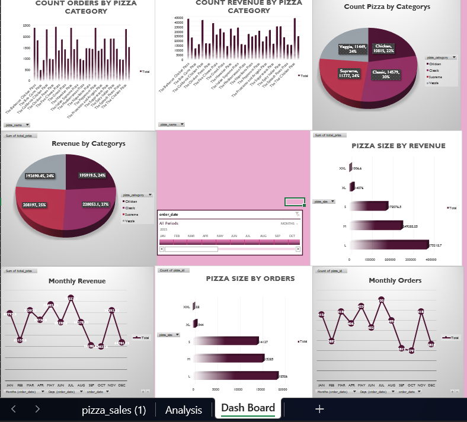
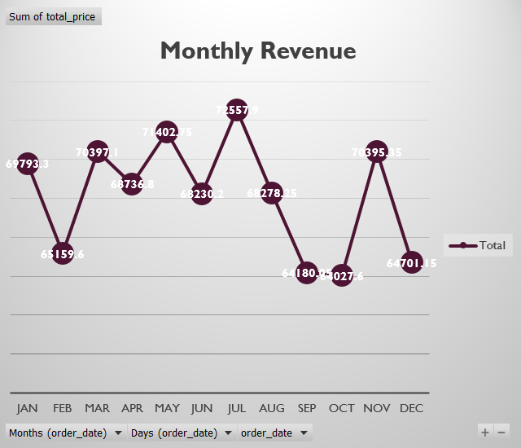
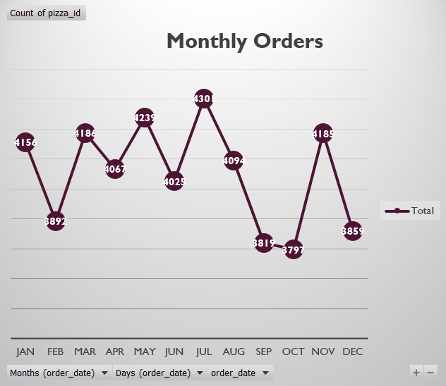
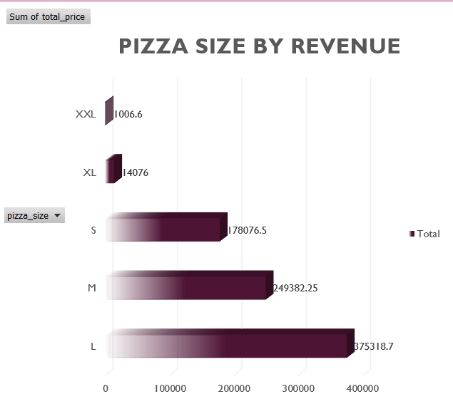
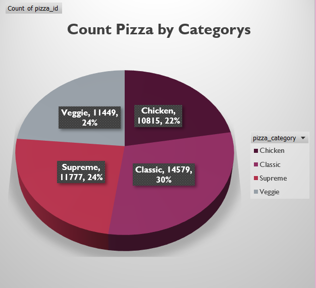
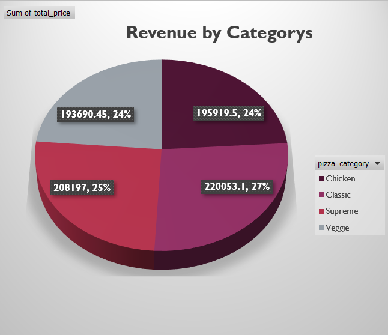
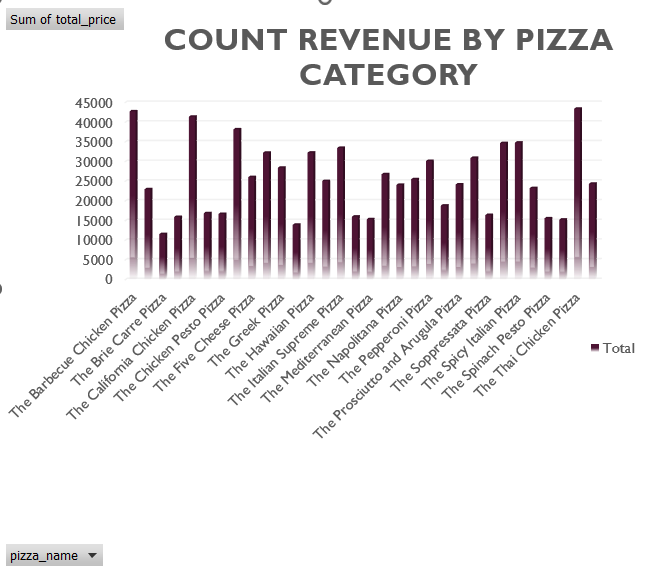
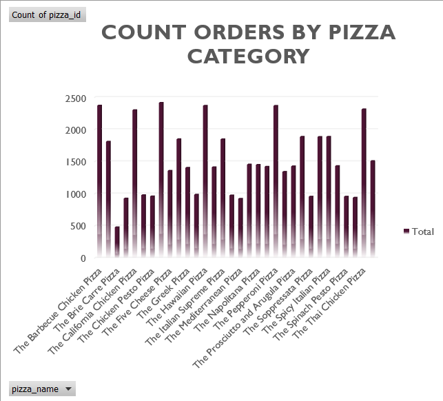

# Pizza Sales Analysis Dashboard

A comprehensive Power BI dashboard designed to analyze pizza sales performance, customer ordering behavior, revenue trends, and product insights for data-driven business decision-making.

---

## Overview

This Power BI project provides an interactive dashboard that helps analyze pizza sales data across different categories, sizes, and time periods.

The dashboard transforms raw sales data into meaningful insights that help businesses understand customer preferences, identify top-performing products, and optimize sales strategies.

It enables stakeholders to:
- Track sales and revenue trends
- Identify top-selling pizzas
- Analyze customer ordering behavior
- Compare pizza categories and sizes
- Monitor business performance over time

---

## Features

- Interactive dashboard with slicers and filters
- KPI cards for quick business performance tracking
- Time-based sales trend analysis
- Product category comparison
- Pizza size performance analysis
- Revenue and order insights
- Dynamic charts and visualizations
- Drill-through and interactive exploration

---

## Tools and Technologies

- Power BI Desktop
- Power Query
- DAX (Data Analysis Expressions)
- Data Modeling
- Excel Dataset

---

## File Information

- Pizza_Sales_Analysis.pbix – Main Power BI dashboard file
- pizza_sales.xlsx – Source dataset
- Dashboard.png – Dashboard preview
- Sales_Trend.png – Sales trend visualization
- Product_Analysis.png – Product performance analysis
- KPI_Overview.png – KPI dashboard view
- Data_Model.png – Data model structure

---

## Dataset Information

The dataset contains detailed pizza sales transaction data.

### Columns Included in the Dataset
- Order ID
- Pizza Name
- Pizza Category
- Pizza Size
- Quantity
- Order Date
- Order Time
- Unit Price
- Total Price

These fields are used to analyze sales performance, customer demand, revenue generation, and operational trends.

---

## Dashboard Insights

- Certain pizza categories generate significantly higher revenue
- Medium and large pizza sizes are most preferred by customers
- Peak sales occur during specific hours and weekends
- A small number of pizzas contribute a large percentage of total sales
- Sales trends show variations across different time periods
- Revenue contribution differs across product categories

---

## Data Analysis Performed

### Sales Performance Analysis
- Total Revenue Analysis
- Total Orders Analysis
- Quantity Sold Analysis
- Daily and Monthly Sales Trends

### Product Performance Analysis
- Best-Selling Pizzas
- Lowest-Selling Pizzas
- Category-wise Sales Comparison
- Pizza Size Analysis

### Customer Behavior Analysis
- Peak Ordering Time Analysis
- Ordering Trends
- Customer Purchase Patterns

### Revenue Analysis
- Revenue by Pizza Category
- Revenue by Pizza Size
- High Revenue Product Identification

---

## Data Transformation (Power Query)

- Removed null and duplicate records
- Cleaned inconsistent data values
- Converted data types appropriately
- Created calculated columns
- Structured dataset for efficient reporting
- Performed data preprocessing for visualization

---

## DAX Calculations

### Measures
- Total Revenue
- Total Orders
- Total Quantity Sold
- Average Order Value
- Revenue by Category
- Sales Growth %

### Functions Used
- SUM()
- COUNT()
- CALCULATE()
- DIVIDE()
- FILTER()
- DISTINCTCOUNT()

---

## Dashboard Screenshots

---

## How to Use

1. Download the `.pbix` file from the repository
2. Open it using Power BI Desktop
3. Interact with slicers and filters
4. Explore visual insights and KPI metrics
5. Analyze sales and customer behavior trends

---

## Business Use Cases

- Restaurant sales analysis
- Product demand analysis
- Revenue optimization
- Customer behavior understanding
- Business intelligence reporting
- Data-driven decision making

---

## Purpose

This project was developed to demonstrate practical skills in:
- Power BI dashboard development
- Data cleaning and transformation
- Data modeling
- DAX calculations
- Business intelligence and reporting
- Interactive data visualization

The project showcases the ability to convert raw business data into actionable insights through analytics and visualization.

---

## Future Improvements

- Add real-time sales data integration
- Implement sales forecasting models
- Add customer segmentation analysis
- Improve dashboard interactivity and UI/UX
- Build predictive analytics features

---

## Author

Your Name
